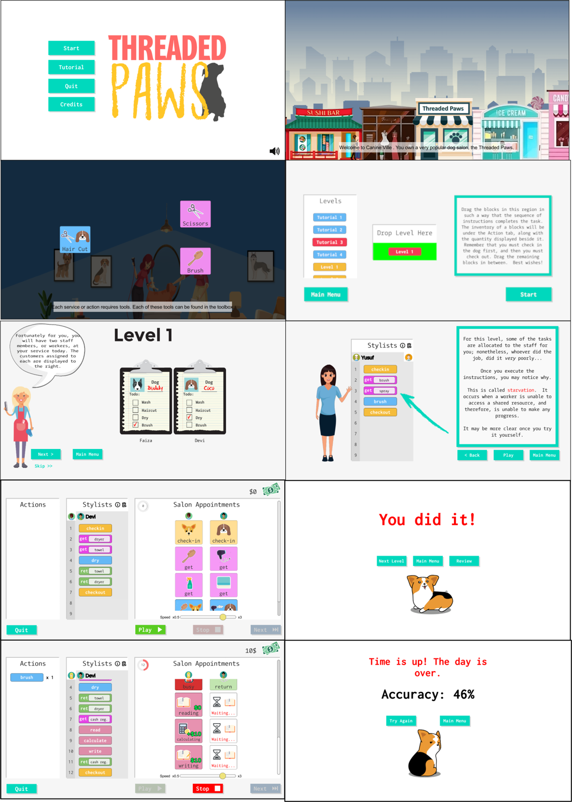

# Threaded Paws

**[Threaded Paws](http://www.seerlab.ca/threaded-paws/)** is a serious game for learning about concurrency concepts including thread interleavings, data races and deadlocks. 

Advances in multi-core processors continue to increase the need for concurrent programming. Unfortunately, writing concurrent programs remains difficult due to the many, possibly unexpected program executions. Furthermore, students learning concurrent programming need to comprehend and avoid common pitfalls such as data races and deadlocks. To address this need, we have developed **Threaded Paws**, a game-based learning tool that teaches students to identify and fix concurrency pitfalls and bugs.  

## Gameplay Overview

**Threaded Paws** is an educational game where you manage a busy dog salon while learning about concurrency.

- **Objective**: Arrange actions like `get`, `return`, `read`, and `write` to help stylists complete appointments without conflict.
- **Mechanics**: Drag and drop blocks to build sequences for each stylist.
- **Challenge**: Avoid concurrency problems like starvation, deadlocks, and data races by ordering steps correctly.

## Educational Focus

Each level highlights a specific concurrency concept:

- **Starvation**: When one stylist never gets the tools they need because others are monopolizing them.
- **Deadlock**: When stylists hold tools and wait on each other forever—no one can move forward.
- **Data Race**: When multiple stylists access shared data (like the cash register) at the same time, leading to inconsistent results.

Players solve these problems by reordering actions and managing shared resources carefully.

## License

This project is licensed under the Mozilla Public License 2.0.  
See the [LICENSE](License.txt) file for details.
